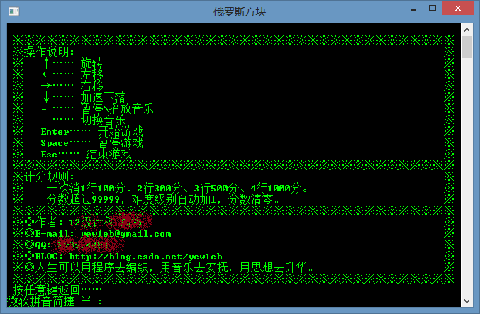

## C++实现俄罗斯方块       &emsp;&emsp;‎&emsp;&emsp;&emsp;2013‎年‎5‎月‎(大一下学期)

## 功能
* 基于Windows Console(控制台)实现，能够设置方块下落速度，以及播放音乐  

## 源码结构
主要的头文件 
`windows.h conio.h`  
程序入口       
`main.cpp `      
console类 {调用Window API在Console上绘图}      
`console.h console.cpp`   

DrawTetris类 {监听键盘输入，相应的改变方块以及切换音乐等}     
`draw_tetris.h draw_tetris.cpp`
  
Other       
`
enter_window.cpp
play_music.cpp
readme.cpp
set.cpp
`

make编译    
`
makefile
`
## 界面
1. 游戏选择界面
  

2. 游戏说明界面

  
3. 游戏界面

***
__音乐过大以外链形式分享：[百度云盘(101.5M)](http://pan.baidu.com/s/1ntC9DMx)__