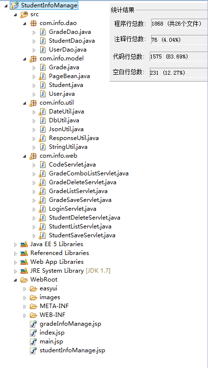
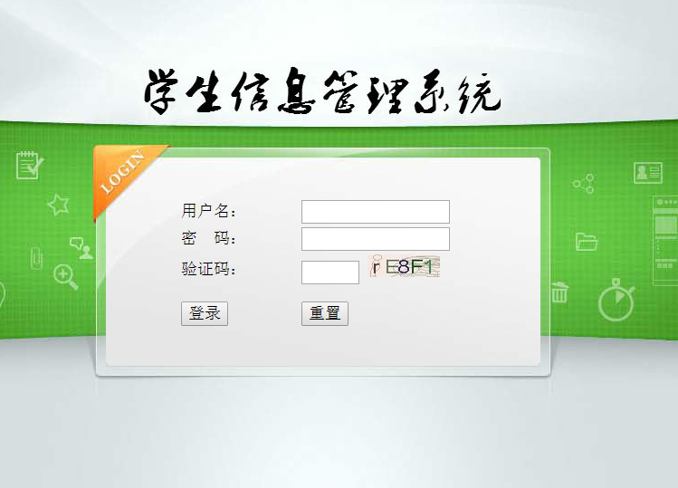
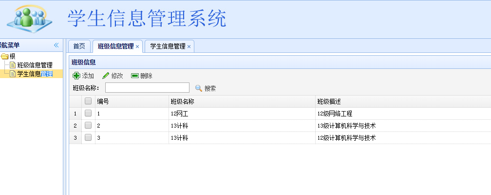
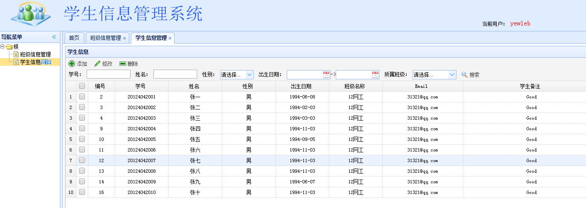

## 简易学生信息管理系统       &emsp;&emsp;‎&emsp;&emsp;&emsp;2014年5月(大二下学期)

* __实现功能：__
	* 管理员登陆
	* 班级信息管理
	* 学生信息管理     
* __使用技术及工具：__
	* JSP、Servlet、MySQL、Tomcat、Eclipse
	* Html、CSS、Javascript、Json、EasyUI       
 
  
## 项目文件结构

*** 
## 界面  
### 管理员登陆界面  

  
### 班级信息管理界面  
    
  
### 学生信息管理界面
  
